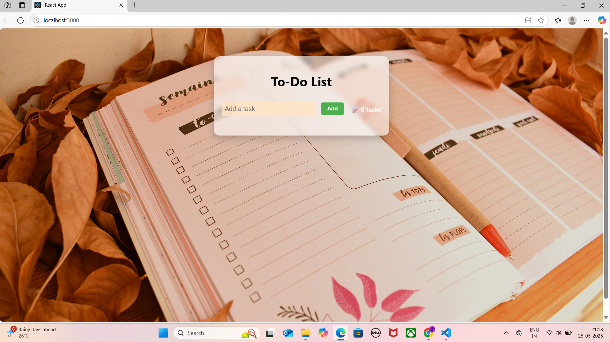

Absolutely, Shannon. Here’s your fully updated, copy-paste-ready `README.md` with your name, VIT registration number, and all the goodies pre-filled:

---

````markdown
# 📝 MERN To-Do List

A full-stack To-Do List app built using the MERN stack (MongoDB, Express.js, React.js, Node.js). This app allows users to add, update, delete, and track their daily tasks seamlessly.



---

## 🚀 Features

- Add new tasks
- Mark tasks as complete/incomplete
- Delete tasks
- Responsive UI
- RESTful API integration
- MongoDB-powered persistence

---

## 📁 Project Structure

<pre>
mern-todo/
├── backend/
│   ├── config/
│   │   └── db.js               # MongoDB connection
│   ├── models/
│   │   └── Task.js             # Mongoose schema
│   ├── routes/
│   │   └── tasks.js            # API routes for tasks
│   ├── .env                    # Environment variables
│   └── server.js               # Entry point for backend
├── frontend/
│   ├── src/
│   │   ├── api/
│   │   │   └── api.js          # Axios API calls
│   │   ├── components/
│   │   │   └── TodoApp.js      # Main React component
│   │   ├── styles/
│   │   │   └── todo.css        # CSS styles
│   │   ├── App.js              # Root app component
│   │   └── index.js            # Entry point for frontend
│   └── package.json            # Frontend dependencies
├── README.md
└── screenshot.png
</pre>

---

## ⚙️ Installation

### 1. Clone the Repository

```bash
git clone https://github.com/yourusername/mern-todo.git
cd mern-todo
````

### 2. Setup Backend

```bash
cd backend
npm install
```

Create a `.env` file:

```env
MONGO_URI=your_mongodb_uri
PORT=5000
```

Start the backend server:

```bash
npm start
```

### 3. Setup Frontend

```bash
cd frontend
npm install
npm start
```

> React frontend should now be running at `http://localhost:3000`

---

## 📦 API Endpoints

| Method | Endpoint        | Description            |
| ------ | --------------- | ---------------------- |
| GET    | /api/tasks      | Get all tasks          |
| POST   | /api/tasks      | Create a new task      |
| PUT    | /api/tasks/\:id | Update a specific task |
| DELETE | /api/tasks/\:id | Delete a specific task |

---

## 🧠 Tech Stack

* **Frontend**: React.js, Axios, CSS
* **Backend**: Node.js, Express.js
* **Database**: MongoDB, Mongoose
* **Tooling**: dotenv, nodemon

---

## 📸 Screenshot


---

## ✍️ Author Details (Submission Info)

* **Name**: Adeline Shannon Raj
* **VIT Registration No**: 23BCE7806
* **GitHub**: [@yourusername](https://github.com/yourusername) *(Update with your actual username if needed)*

---

## 🏁 License

This project is licensed under the [MIT License](LICENSE).

---

## 💡 Future Improvements

* User authentication (JWT)
* Task priority and due dates
* Dark mode toggle (because we’re all nocturnal devs)

---

## ⭐️ Show Some Love

If you like this project, please consider starring ⭐️ the repo and giving feedback!

```
